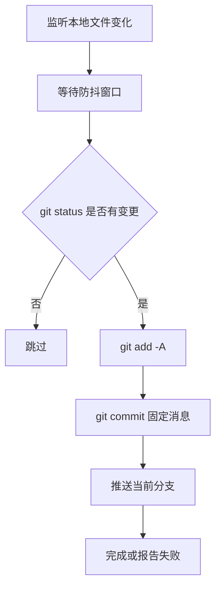

# AGENTS.md

## 工程功能

这是一个已经生成好的静态博客站点仓库，用于托管个人博客页面、文章页面、分类、标签、图片和站点资源。

## 关键目录结构

```text
.
├── index.html                 # 站点首页
├── post/                      # 博客文章静态页面
├── categories/                # 分类页面
├── tags/                      # 标签页面
├── images/                    # 博客图片资源
├── LLM/                       # LLM 相关文章图片资源
├── RAG/                       # RAG 相关文章图片资源
├── agents/                    # Agent 相关文章图片资源
├── js/                        # 站点 JavaScript 静态资源
├── sass/                      # 站点 CSS 静态资源
├── lib/                       # 第三方前端静态资源
└── scripts/                   # 本地自动化脚本
```

## 本地自动化

### 文件变更自动同步

`scripts/wushao666-auto-git-sync.sh` 用于监听本仓库中的本地文件变化。当 `git status --porcelain` 检测到存在变更时，脚本会自动执行：

```bash
git add -A
git commit -m "chore: auto sync changes"
git push origin <当前分支>
```

设计逻辑：

1. 为什么这样设计：用户希望在本地文件被修改后自动完成 `add -> commit -> push`，而不是按固定时间轮询。
2. 怎么做的：脚本使用 `fswatch` 监听仓库目录，忽略 `.git` 和 `.DS_Store`，并通过防抖避免频繁触发。
3. 做到了什么样子：有变更才提交；没有变更直接跳过；push 失败或超时时保留本地 commit，不执行 `reset`、`rebase`、`force push` 等破坏性操作。
4. 提示机制：同步成功、缺少依赖、无法进入仓库、detached HEAD、`git add` 失败、commit 失败、push 失败或超时时，会通过 macOS 通知提示；无变更跳过时不提示，避免噪声。

运行方式：

```bash
brew install fswatch
./scripts/wushao666-auto-git-sync.sh
```

如需在 macOS 登录后常驻运行，可将 `scripts/wushao666-com.wushao.auto-git-sync.plist` 安装到 `~/Library/LaunchAgents/`，再用 `launchctl bootstrap` 启动。

流程图：


